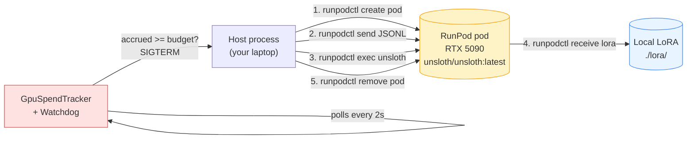
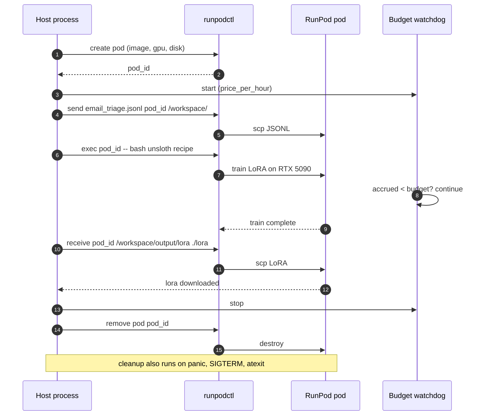

# Example 47 — RunPod fine-tune orchestration (Gap #8a)

> A senior engineer at a 50-500 person SaaS company has a corporate
> card and no time to learn AWS. This example wraps `runpodctl` so
> they can rent an RTX 5090, run the email-triage Unsloth fine-tune
> on it, download the LoRA back to their machine, and tear the pod
> down — all from one Python command, with a hard budget cap and
> cleanup-on-failure that holds even if the host process panics.

This is the **default working tier** of the inference spectrum
([Gap #8](../../../../../atelier/docs/v1.0/lighthouse-tour.md)). It is
also the first example most operators will copy-paste, so it carries
the orchestration patterns — pod lifecycle, budget cap, cleanup,
blended cost — that the other inference-spectrum examples (44 Colab,
45 Vast.ai, 46 custom endpoint, 48 Modal) mirror.

## What this proves

Three invariants the audience-pin person needs to see, in plain
English:

1. **The budget cap holds.** A `GpuSpendTracker` accrues
   `$/hr × elapsed_hours` against the project. A background watchdog
   polls every 2 seconds; the moment accrued cost crosses
   `--budget-usd`, the pod is torn down and the host process exits.
   No "we'll catch it next billing cycle" surprise.
2. **The LoRA actually downloads.** `runpodctl receive` pulls
   `/workspace/output/lora` from the rented pod onto the developer's
   local disk. The downloaded artifact deploys verbatim via Example
   38's Ollama path — no second fine-tune required.
3. **The pod actually tears down — even on panic.** Cleanup is wired
   three ways: a `try/finally` around the orchestration body, an
   `atexit` hook for normal exits, and `SIGTERM`/`SIGINT` handlers
   for kill signals. A stuck pod is the only thing in this story
   that would silently drain the budget; we belt-and-braces it.

A clean run on RTX 5090 incurs a **GPU bill of about $0.35** (roughly
30 minutes × $0.69/hr) and produces the same LoRA Example 38's local
CUDA path produces — but on a GPU the developer doesn't own and never
has to babysit.

## Architecture

The orchestration is a five-step pipeline with cleanup wired around it:



Time-ordered flow with cleanup paths:



## How to run

### Stub mode — clean machine, 60 seconds, $0 spend

```bash
pip install sagewai
python 47_runpod_finetune_orchestration.py
```

Expected: the example prints the exact `runpodctl` commands it would
run, the budget breakdown, and the cost-down comparison. Nothing
contacts RunPod. This is the path the audience-pin person sees first
— they read the orchestration before they spend a cent.

Excerpt from the proof block:

```
── Budget breakdown ──

GPU             = NVIDIA RTX 5090
Price           = $0.6900/hr
Expected hours  = 0.50h (Unsloth 3B LoRA, 8 samples, 1 epoch)
Expected spend  = $0.3450
Budget cap      = $2.00  (watchdog kills pod if exceeded)
```

### Full live path — rent a real RTX 5090

One-time setup:

```bash
# 1. Set RUNPOD_API_KEY in ~/.sagewai/.env
#    (template at atelier/docs/v1.0/inference-provisioning-setup.md)
echo 'RUNPOD_API_KEY=<your-key>' >> ~/.sagewai/.env

# 2. Install runpodctl
brew install runpod/runpodctl/runpodctl
runpodctl config --apiKey "$RUNPOD_API_KEY"

# 3. (Recommended) Set a $25 spending limit at console.runpod.io
#    so the dashboard cap matches the example's budget cap.
```

Then:

```bash
python 47_runpod_finetune_orchestration.py --live
```

Override the GPU type or budget cap as needed:

```bash
# Cheaper RTX 4090 (~$0.34/hr instead of ~$0.69/hr)
python 47_runpod_finetune_orchestration.py --live \
    --gpu-type "NVIDIA RTX 4090"

# Tighter budget (watchdog kills the pod sooner)
python 47_runpod_finetune_orchestration.py --live --budget-usd 1.00
```

### Expected output (proof section, live run)

```
───  4. The proof — live run  ───────────────────────────────────────────

  Pod outcome       : completed
  GPU               : NVIDIA RTX 5090 @ $0.6900/hr
  Rental duration   : 28.4 min (1704s wall)
  Rental spend      : $0.3265  (GPU bill for this run; budget cap = $2.00)
  Cloud-call baseline (calculate_cost): $0.000320/call
  LoRA downloaded   : /tmp/sagewai-runpod-out-XXX/lora
  Pod torn down     : True

───  Cost-down: cloud-LLM baseline vs. fine-tuned local  ────────────────

  Cloud baseline    : $0.005000/call (Anthropic Haiku, post-overhead)
  Local (fine-tuned): $0.000000/call (Ollama serves the LoRA)

  At 200 emails/day for 30 days:
    cloud-only      = $    30.00/month ($   360.00/yr)
    after fine-tune = $     0.00/month — the same task costs $0
    one-time spend  = $   0.3265  (GPU bill for this demo run)

  Payback           : after ~65 cloud calls, the GPU rental cost has paid for itself
                      (0.3 days at 200/day)
```

## Real-world use cases

The pattern in this example — *one orchestration script + one budget
cap + one cleanup contract* — fits any workload where a senior SaaS
engineer needs to fine-tune a small model on a GPU they don't own.
Three people who'd drop it in this quarter:

### 1. Senior platform engineer at a 200-person fintech SaaS — fine-tune the support-ticket classifier

Your support tooling runs 200 tickets/day through an LLM that
classifies urgency, drafts replies, and escalates the hard ones.
Cloud Haiku is $30/month and growing; the CFO has asked you to bring
that to $0 next quarter.

| Concern | How this pattern solves it |
|---|---|
| The CFO will see the line item; the GPU rental needs to be capped | `--budget-usd 2.00` + the watchdog. Pod dies before the cap, period. |
| If the CI agent that runs the fine-tune crashes, the pod must not silently keep accruing | Cleanup runs in `try/finally`, `atexit`, AND `SIGTERM` handlers — three independent paths. |
| The LoRA must deploy somewhere — not be a "ran once on Colab" artifact | `runpodctl receive` pulls the safetensors to local disk; Example 38's Ollama deploy step runs against it verbatim. |

### 2. Senior infra engineer at a 300-person devtools company — internal-doc Q&A on private runbooks

Your engineers ask "how does the billing service handle proration?"
twenty times a day on Slack. You'd rather have a 3B model fine-tuned
on your runbooks answer than burn Sonnet tokens — and the corpus
can't go to a managed fine-tuning vendor.

| Concern | How this pattern solves it |
|---|---|
| The corpus is private; we can't paste it into a managed fine-tuning service | RunPod is bare-metal — your data leaves your laptop, runs on the rented pod, and the pod is destroyed. No third-party data plane. |
| We don't have a "GPU person"; whoever runs this must be ops-able by a generalist engineer | One Python command, one budget cap, one cleanup contract. The README is what they read. |
| The fine-tune is going to take a few iterations — recipe + dataset will change | The recipe lives inline in `REMOTE_FINETUNE_SCRIPT`; swap the JSONL or the LoRA hyper-params and re-run. Same budget contract holds. |

### 3. Engineering manager at a 400-person e-commerce SaaS — code-review summariser

PRs land at 200/day. You want a summariser that drafts the "what
changed and why" paragraph for each, kept up to date as the codebase
drifts. Burning Opus across that many diffs is the wrong cost story;
a fine-tune on your repo's history is cheap and private.

| Concern | How this pattern solves it |
|---|---|
| The training corpus is git history — sensitive | Same data-locality story as #2: the corpus rides up to the pod, the LoRA rides back down, the pod dies. |
| The summariser will be re-trained every 2-4 weeks as the codebase shifts | Each retrain is one `runpodctl create` + budget cap + cleanup. GPU cost is predictable (~$0.35 for a ~30-min RTX 5090 run at $0.69/hr). |
| The deployed LoRA needs to plug into the existing PR-review tooling | Ollama (Example 38) is the deploy target; LiteLLM-compatible HTTP. Drop into whatever currently calls Anthropic. |

## What you can change

The example is a thin orchestration script. Things you'll swap for
production:

- **Different GPU type.** `--gpu-type "NVIDIA RTX 4090"` halves the
  per-hour cost. `--gpu-type "NVIDIA A100 80GB"` for big bases.
  Pricing table lives at the top of the `.py` file
  (`GPU_PRICE_PER_HR_USD`); update from
  `atelier/docs/v1.0/inference-provisioning-landscape.md` if RunPod
  shifts list pricing.
- **Different base model.** `REMOTE_FINETUNE_SCRIPT` pins
  `unsloth/Llama-3.2-3B-Instruct-bnb-4bit`. Swap to a 7B or 8B base
  for a larger fine-tune; the RTX 5090's 32GB will still fit a 7B
  4-bit LoRA comfortably.
- **Different budget cap.** Default is `$2.00` to match the issue's
  acceptance criterion. Tighten to `$0.50` for a quick smoke; loosen
  to `$5.00` for a longer fine-tune of a bigger base.
- **Different upload target.** `runpodctl send` works for any local
  artifact. Replace the email-triage JSONL with whatever your
  Curator-built dataset emits.
- **Different deploy target.** The example downloads the LoRA and
  stops. To go end-to-end, hand it to Example 38's Ollama deploy
  path. To serve it as a hosted endpoint, hand it to Example 48
  (Modal serverless) instead.
- **Polling cadence.** The watchdog polls every 2 seconds. Pricing
  granularity is per-second on RunPod, so 2s is a good balance
  between responsiveness and overhead. Tighten to 0.5s if you want
  sub-cent precision; loosen to 10s if your pods run for hours.

## What's exercised

- `runpodctl create pod` — exact flags from
  `atelier/docs/v1.0/inference-provisioning-landscape.md`
- `runpodctl send` / `runpodctl receive` — JSONL upload + LoRA
  download; same `scp`-shaped semantics
- `runpodctl exec` — runs the inline Unsloth recipe inside the pod
- `runpodctl remove pod` — teardown, called from three independent
  paths (`try/finally`, `atexit`, `SIGTERM`/`SIGINT` handlers)
- `sagewai.observability.costs.calculate_cost` — the per-call
  baseline that pairs with the GPU-rental tracker; the Observatory
  dashboard sums both
- The local `GpuSpendTracker` dataclass — accrues
  `$/hr × elapsed_hours`; mirrors the API shape Example 34 uses for
  LLM-call cost so the Observatory page can render both side-by-side
- Example 38's Unsloth recipe — the same 4-bit Llama-3.2-3B + LoRA
  r=16 / α=32 / 1 epoch / lr=2e-4 / batch=2 hyper-params, just
  running on rented hardware instead of local Apple Silicon

## What to read next

If you ran this and want to go deeper, the rest of the inference
spectrum:

- **Example 48** (`48_modal_serverless_inference.py`) —
  serverless inference. Take the LoRA this example produces and
  serve it via Modal's per-second autoscaling, no idle-GPU cost.
- **Example 44** (`44_colab_free_cuda.py`) — same fine-tune, but on
  free Colab T4 with Drive-sync orchestration. The democratisation
  story for developers without a corporate card.
- **Example 45** (`45_vastai_marketplace_bid.py`) — Vast.ai's
  budget-aggregator marketplace. Per-host reliability scoring +
  ~$0.20-$0.45/hr for 24GB GPUs. Right when price-per-hour matters
  more than provisioning latency.
- **Example 46** (`46_custom_inference_as_tool.py`) — bring-your-own
  endpoint. Plug in whatever inference you already host (vLLM,
  Triton, your own GKE deployment) as a Sagewai tool/MCP.
- **Example 38** (`38_unsloth_finetune.py`) — the Ollama deploy
  step the LoRA from this example feeds into. Run it next to drive
  the local-inference end of the loop.
- **Example 34** (`34_observatory_cost_tracking.py`) — the
  blended-cost view (cloud-LLM + GPU rental) that consumes the
  numbers this example records.
