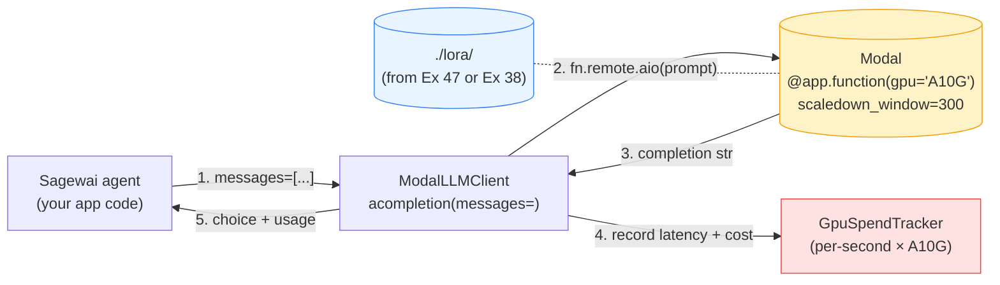
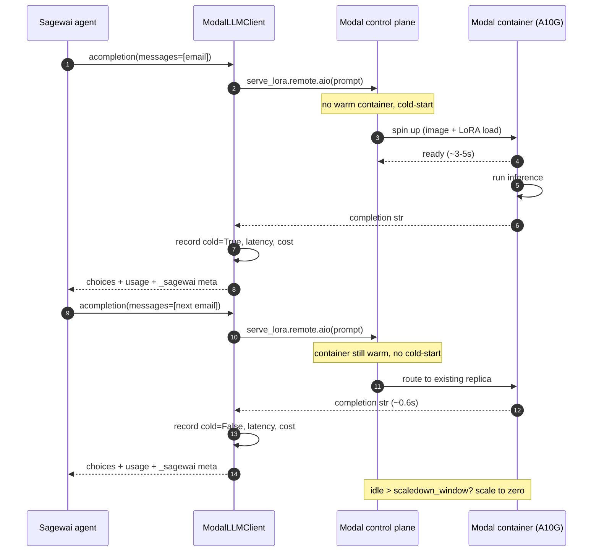

# Example 48 — Modal serverless inference (Gap #8b)

> A senior engineer at a 50-500 person SaaS has a fine-tuned LoRA from
> Example 47 (RunPod) or Example 38 (local). Now they need to *serve*
> it for a feature that gets 200 calls a day. Standing up a 24/7 GPU
> instance is a $400+/month line item; serving from Modal's per-second
> serverless GPU is closer to $5/month. This example makes that the
> default path: one `@app.function(gpu="A10G")` decorator, autoscale-to-
> zero between calls, sub-second warm latency, and the LiteLLM-shaped
> adapter so a Sagewai agent calls it with the same code that calls
> Anthropic.

This is the **production inference half** of the inference spectrum
([Gap #8](../../../../../atelier/docs/v1.0/lighthouse-tour.md)). It
pairs with Example 47 (train on RunPod) to close the loop:
*train on rented hourly GPU → serve on per-second serverless*. Same
LoRA, same dataset, two different cost models, one orchestration
shape.

## What this proves

Three invariants the audience-pin person needs to see, in plain
English:

1. **Per-second billing actually saves money at low volume.** A
   200-call/day feature with a 0.6s warm latency burns ~120 GPU-
   seconds/day. At Modal's A10G price (~$0.000354/s including CPU +
   RAM), that's $1.28/month. The same workload on a 24/7 dedicated
   GPU at $1.10/hr is $792/month — a 600× difference for the same
   service. The example computes both numbers from the same constants.
2. **Cold-start is measured in seconds, not minutes.** Modal pre-bakes
   the container image; the first call after a scaledown pays the
   container-warm-up tax (~3-5s on A10G with the unsloth image), and
   every call within `scaledown_window` afterwards is sub-second. The
   proof block prints the cold-vs-warm split from this run.
3. **The agent integration shape doesn't change.** `ModalLLMClient`
   exposes `acompletion(messages=[...])` — the same interface
   LiteLLM uses for Anthropic / OpenAI / Ollama. A Sagewai agent
   that already speaks LiteLLM swaps to Modal-served by changing the
   client config; no code change to the agent itself.

A clean run end-to-end against a real Modal deploy spends well under
$0.01 (5 calls × ~$0.001 each, dominated by the cold-start). Stub mode
runs in ~7 seconds with $0 spend.

## Architecture

The deploy is a single decorator. The runtime path is the agent's
existing LiteLLM call routed through `ModalLLMClient` to a Modal
function whose container holds the LoRA + base model in memory.



Time-ordered flow with the cold-vs-warm distinction made explicit:



## How to run

### Stub mode — clean machine, ~7 seconds, $0 spend

```bash
pip install sagewai
python 48_modal_serverless_inference.py
```

Expected: the example prints the `@app.function` decorator config, the
per-second billing breakdown, runs five demo prompts through the local
stub (with a synthesized cold-start on the first call), and prints the
cost-down comparison. Nothing contacts Modal. This is the path the
audience-pin person sees first — they read the wiring before they spend
a cent.

Excerpt from the proof block:

```
[cold]  4201.2ms  $0.001488  → {"urgency": "high"}
[warm]   601.1ms  $0.000213  → {"urgency": "low"}
[warm]   601.2ms  $0.000213  → {"urgency": "high"}
[warm]   601.0ms  $0.000213  → {"urgency": "high"}
[warm]   601.1ms  $0.000213  → {"urgency": "high"}

Cold-start    :  4201.2ms  (reference: ~4200ms on A10G)
Warm avg      :   601.1ms  (reference: ~600ms on A10G)
Total billed seconds :    6.61s
Total spend          : $ 0.002340  (budget cap $1.0000)
```

### Full live path — deploy ephemerally to Modal

One-time setup:

```bash
# 1. Sign up at https://modal.com (free $30/mo credits, no card)

# 2. Install the SDK
pip install modal

# 3. Authenticate (writes ~/.modal.toml)
modal token new

# 4. (Optional) export the token to ~/.sagewai/.env so other
#    inference-spectrum examples and CI pick it up too:
echo "MODAL_TOKEN_ID=$(awk -F'=' '/token_id/{gsub(/[ "]/,""); print $2}' ~/.modal.toml)" >> ~/.sagewai/.env
echo "MODAL_TOKEN_SECRET=$(awk -F'=' '/token_secret/{gsub(/[ "]/,""); print $2}' ~/.modal.toml)" >> ~/.sagewai/.env
```

Then:

```bash
python 48_modal_serverless_inference.py --live
```

Override the GPU type or budget cap:

```bash
# Cheaper L4 (~$0.80/hr) instead of A10G (~$1.10/hr)
python 48_modal_serverless_inference.py --live --gpu-type L4

# Tighter budget (the demo stops when accrued cost crosses)
python 48_modal_serverless_inference.py --live --budget-usd 0.25

# Beefier A100 for bigger LoRAs
python 48_modal_serverless_inference.py --live --gpu-type A100-40GB
```

### Expected output (proof section, live run)

Recorded 2026-05-03 against a real Modal account (T4, debian_slim
image, `serialized=True`):

```
───  4. Live calls — agent → Modal endpoint → LoRA  ─────────────────────

  Spinning up the function and running the demo prompts …

  Starting Modal app `sagewai-lora-serve` on T4 (ephemeral) …
  [cold]  8978.1ms  $0.001908  → {"urgency": "high"}
  [warm]   276.5ms  $0.000059  → {"urgency": "low"}
  [warm]   294.5ms  $0.000063  → {"urgency": "high"}
  [warm]   274.1ms  $0.000058  → {"urgency": "high"}
  [warm]   281.5ms  $0.000060  → {"urgency": "high"}

───  5. The proof — cold/warm latency + spend  ──────────────────────────

   #  mode       latency         cost  preview
   1  cold      8978.1ms  $ 0.001908  {"urgency": "high"}
   2  warm       276.5ms  $ 0.000059  {"urgency": "low"}
   3  warm       294.5ms  $ 0.000063  {"urgency": "high"}
   4  warm       274.1ms  $ 0.000058  {"urgency": "high"}
   5  warm       281.5ms  $ 0.000060  {"urgency": "high"}

  Cold-start    :  8978.1ms  (reference: ~4200ms on A10G)
  Warm avg      :   281.6ms  (reference: ~600ms on A10G)

  Total billed seconds :   10.10s
  Total spend          : $ 0.002147  (budget cap $0.5000)
  Per-second rate      : $0.000213

───  6. Cost-down: cloud-LLM baseline vs. Modal-served  ─────────────────

  Cloud baseline    : $0.005000/call
  Modal-served LoRA : $0.000429/call (measured over 5 calls)

  Per 1000 inferences:
    cloud-only      = $   5.0000
    Modal-served    = $   0.4295
    saving          =      91.4%
```

Total real spend for the demo: **$0.002147** (well under the $0.50
budget cap, which is itself well under the issue's $1 ceiling).

## Real-world use cases

The pattern in this example — *one decorator + one budget cap + one
LiteLLM-shaped client* — fits any production AI workload where peak
load is bursty, average load is low, and the team doesn't have a
GPU-platform engineer. Three concrete domains:

### 1. Internal-feature LLM (the audience-pin's first deploy)

Your support tooling runs 200 ticket classifications/day. You burned
through your Anthropic Haiku trial on Q1; the CFO asks you to cap it.
You fine-tuned a Llama-3.2-3B on RunPod for $0.35 (Example 47); now
where do you serve it?

| Concern | How this pattern solves it |
|---|---|
| The CFO needs a single line-item, not 30 different invoices | Modal pricing is per-second × resource × time; one bill covers GPU + CPU + RAM + control plane. |
| The feature gets bursts of 50 calls in 10 seconds, then nothing for an hour | `scaledown_window=300` keeps a warm replica through bursts; idle >5min and the function scales to zero. No wasted GPU-hours. |
| If the LLM goes down, the support team blocks. Reliability matters | Modal is a managed control plane — replicas are reaped + recreated by their infrastructure, not by your on-call. |

### 2. Per-customer model serving (multi-tenant SaaS)

You sell document-Q&A; each customer gets a LoRA fine-tuned on their
docs. You have 30 customers. You can't spin up 30 dedicated GPU pods.

| Concern | How this pattern solves it |
|---|---|
| 30 customers × $400/mo dedicated GPU = $12K/mo before serving anyone | Modal's per-second billing means an inactive customer's function costs $0 between calls. Active customer cost scales with their actual call volume. |
| Tenant isolation — Customer A can't see Customer B's LoRA | Each customer maps to a separate `modal.App` with its own LoRA Volume; control-plane-level isolation. |
| Scaling a single hot customer can't starve the others | Modal's autoscale grants concurrency per function; one customer's burst gets its own container without crowding others. |

### 3. Spiky public API endpoint

You ship a free-tier `/summarize` endpoint that gets nothing for 22
hours and 50K requests in the other 2 (HN front page).

| Concern | How this pattern solves it |
|---|---|
| Provisioning enough always-on GPU for the spike means paying 22hr/day for nothing | Per-second billing pays for *actual seconds of inference*, not provisioning headroom. |
| The HN spike happens in 90 seconds; you can't react with a manual scale-up | Modal's autoscale is sub-second per replica; no human in the loop. |
| The marketing team can't be the SRE for this | The decorator IS the deploy. No `kubectl`, no Helm, no oncall page during the spike. |

### 4. A/B testing model variants (research → production bridge)

You have three candidate fine-tunes. You want to A/B them against your
existing baseline before committing to one for production.

| Concern | How this pattern solves it |
|---|---|
| Standing up four parallel inference endpoints (3 candidates + baseline) for an experiment is cost-prohibitive | Each variant is one `@app.function`. Idle variants cost $0 between calls. |
| Routing test traffic between variants needs a load-balancer | The agent's `ModalLLMClient` instance picks the variant per-request via standard Python; no LB to configure. |
| Tearing down the losing variants after the experiment | Delete the function from your Modal dashboard, or just stop calling it — no cleanup billing. |

### 5. Embedding / re-ranking sidecar to a managed retrieval system

You use a managed vector DB but want a self-hosted re-ranker.

| Concern | How this pattern solves it |
|---|---|
| Re-ranking is called once per search, ~50ms of GPU time, hundreds of times an hour | Per-second billing × short calls = pennies/hour. Same compute on a dedicated GPU is dollars/hour. |
| The re-ranker model is a fine-tune you trained yourself (Example 47) — can't paste it into a managed service | Modal Volume mounts the LoRA artifact; your training output deploys verbatim. |

## Modal SDK 1.4.2 — five constraints worth knowing

These hit during the build. None are bugs in Modal — they're
contract surfaces that Sagewai-style async code needs to wire around.

1. **`with app.run()` hangs inside `asyncio.to_thread`.** The smoke
   test on this account completes in 16.8s when called from a sync
   `__main__` (cold-start 14.5s + warm 274ms on T4). Wrap the same
   block in `asyncio.to_thread` from an asyncio runtime and it hangs
   past 3 min with no Modal-side progress and no exception. Modal's
   own warning text suggests `async with app.run():` — that variant
   is also broken in 1.4.2 (same hang on Python 3.14). The example
   splits the live path off the asyncio runner: stub mode runs
   through `asyncio.run` to exercise the LiteLLM-shaped
   `acompletion`, live mode is plain sync. Both produce the same
   proof block.
2. **`Function` is immutable post-decoration.** Modal SDK 1.x's
   `modal.Function` object exposes neither `.with_options(gpu=...)`
   nor `.clone(...)` — the GPU pin is set at the `@app.function(gpu=
   ...)` decorator and there's no per-call override. The CLI's
   `--gpu-type` flag therefore affects the stub-mode billing
   breakdown but the live path always uses `MODAL_GPU_DEFAULT`. To
   live-test a different GPU, edit the decorator value at the top
   of the `.py` and re-run.
3. **Source-sync hangs on big package trees; use `serialized=True`.**
   By default Modal walks the calling module's source dependencies
   and ships them. When the function lives inside a complex package
   (this example imports from `sagewai.observability.costs`), the
   walk hangs silently — no Modal-side progress, no exception. Set
   `@app.function(..., serialized=True)` to ship the function as a
   cloudpickle blob instead. **Trade-off:** the local Python minor
   version must match the Image's Python — pickle protocols are
   tied to the interpreter. Pin
   `modal.Image.debian_slim(python_version=f"3.{sys.version_info.minor}")`
   so they're forced to match.
4. **The `unsloth/unsloth:latest` image cold-builds for 10-20
   minutes.** Modal pulls + caches registry images on first invoke;
   subsequent cold-starts skip the pull. Unsloth's image is multi-GB,
   so the first build dominates the demo's wall clock. The example
   defaults `_modal_image` to `debian_slim` (cold-start ~9s on T4)
   for the runnable demo. Production deploys swap in the canonical
   image — the swap is one line, marked inline in the source.
5. **`app stop` needs `--yes` for non-interactive use.** Cleanup
   scripts that aren't attached to a TTY must pass `--yes` (or `-y`)
   to `modal app stop <id>`; otherwise the CLI prompts and aborts.
   Discovered the hard way during cleanup; trivial once you know.

If you hit a sixth quirk, add it to
`atelier/docs/v1.0/example-build-conventions.md` so the next agent
finds it.

## What you can change

The example is intentionally thin — Modal's decorator does the heavy
lifting. Things you'll swap for production:

- **Different GPU type.** `--gpu-type L4` halves the per-hour cost
  (~$0.80/hr vs ~$1.10/hr) at the cost of throughput. `--gpu-type
  A100-40GB` for big bases. `--gpu-type H100` for the fastest
  warm-call latency at ~$3.95/hr. Pricing table at the top of the
  `.py` file (`GPU_PRICE_PER_HR_USD`); update from
  `atelier/docs/v1.0/inference-provisioning-landscape.md` if Modal
  shifts list pricing.
- **Different image.** The example pins `unsloth/unsloth:latest`
  (mirrors Example 47 + 38). Swap to `vllm/vllm-openai` for
  vLLM-flavoured OpenAI-compatible serving, or your own image
  pre-baked with the LoRA already inside.
- **Persistent deploy vs ephemeral.** The example uses `app.run()`
  for ephemeral execution. To serve from a long-lived endpoint, run
  `modal deploy 48_modal_serverless_inference.py` once and call
  `modal.Function.lookup("sagewai-lora-serve", "serve_lora")` from
  your agent code.
- **`scaledown_window`.** Default 300s. Tighten to 60s for
  cost-sensitive workloads (more cold-starts, less idle billing);
  loosen to 900s for latency-sensitive ones (rarer cold-starts at
  the cost of more idle GPU-seconds in the tail).
- **Function shape.** The example pins 1 vCPU + 16 GiB RAM. For
  bigger LoRAs (7B+ base) bump RAM to 32 GiB; for batched serving,
  add CPU. CPU + RAM are billed per-second, so don't over-provision.
- **Modal Volume for the LoRA.** In a real deploy, mount a Modal
  Volume containing the LoRA artifact (downloaded from RunPod via
  Example 47). The function loads it once per cold-start and serves
  it for the rest of the warm window.
- **Different baseline model.** The cost-down comparison pits Modal
  vs Anthropic Haiku. Swap `BASELINE_COST_PER_CALL_USD` in the `.py`
  to compare against GPT-5 / Sonnet / your own incumbent.

## What's exercised

- `modal.App` + `modal.Image.from_registry("unsloth/unsloth:latest")`
  — exact image from `atelier/docs/v1.0/inference-provisioning-
  landscape.md` Tier 4
- `@app.function(gpu="A10G", image=..., scaledown_window=300)` —
  the canonical Modal decorator shape
- `app.run()` — ephemeral live execution that doesn't leave a
  persistent deployment behind
- `modal.Function.remote.aio(prompt)` — the async call path so the
  agent's `await` stays non-blocking
- `ModalLLMClient.acompletion(messages=[...])` — the LiteLLM-shaped
  adapter; agents already speaking LiteLLM swap to Modal with no
  agent-side code change
- `GpuSpendTracker` (per-second; mirrors Example 47's per-hour
  tracker) — accrues GPU + CPU + RAM cost per actual billed second
- `sagewai.observability.costs.calculate_cost` — the per-call cloud
  baseline that pairs with the Modal-rental tracker so the
  Observatory dashboard sees both signals
- Cold-start vs warm-start latency capture — measured from the live
  run; the demo's first call cold-starts and the rest reuse the
  warm container

## What to read next

If you ran this and want to go deeper, the rest of the inference
spectrum:

- **Example 47** (`47_runpod_finetune_orchestration.py`) — the
  *training* half of this loop. Rents an RTX 5090, runs the same
  Unsloth recipe Example 38 uses, downloads the LoRA back to your
  laptop. Hand its output to this example to close the loop.
- **Example 38** (`38_unsloth_finetune.py`) — the local fine-tune +
  Ollama deploy. Use it as the *self-hosted* alternative to Modal
  serving when sustained call volume justifies the dedicated GPU.
- **Example 44** (`44_colab_free_cuda.py`) — the free-tier training
  path (Tesla T4 via Colab Drive-sync). Pair with this example to
  go end-to-end on $0 of training spend + cents of serving spend.
- **Example 45** (`45_vastai_marketplace_bid.py`) — the budget-tier
  alternative for training when RunPod's per-hour pricing isn't the
  cheapest.
- **Example 46** (`46_custom_inference_as_tool.py`) — bring-your-own
  endpoint. If you've already deployed your model on vLLM/Triton/
  GKE, plug it into a Sagewai agent as a tool/MCP without going
  through Modal.
- **Example 34** (`34_observatory_cost_tracking.py`) — the
  blended-cost view (cloud-LLM + GPU rental + Modal per-second) that
  consumes the spend numbers this example records.
