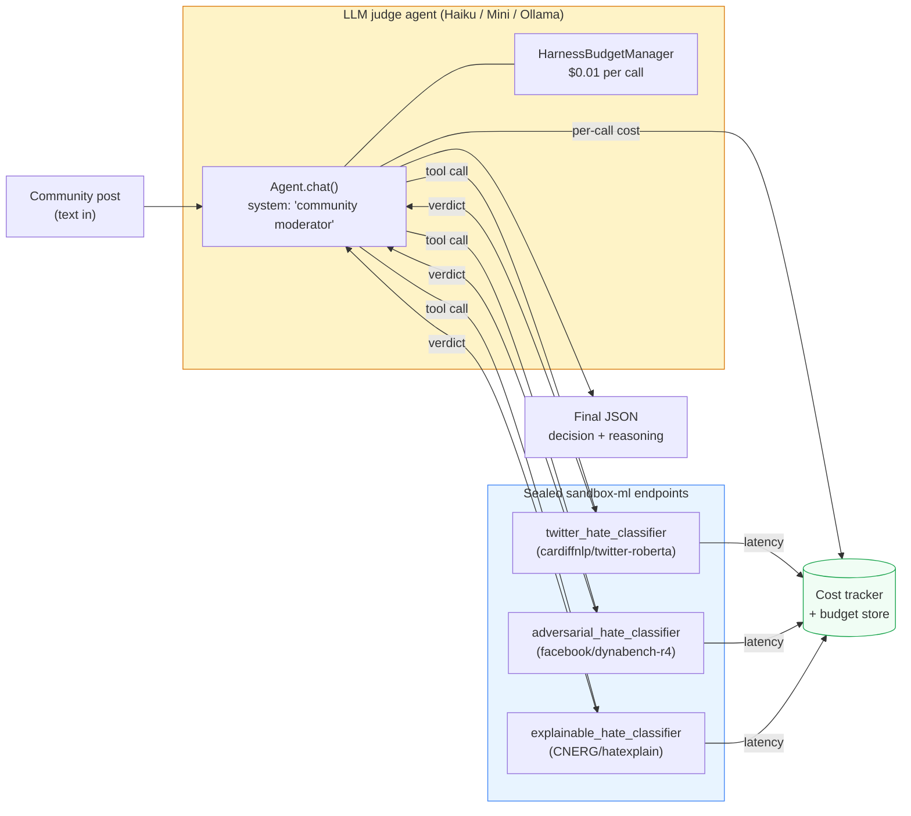
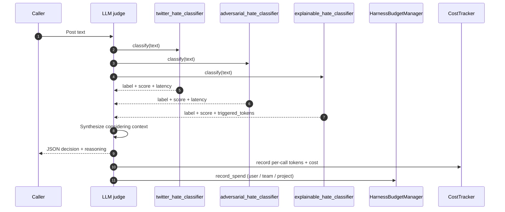

# Example 49 — Community moderation: ML ensemble + LLM judge in sealed containers

> Three HuggingFace hate-speech classifiers run inside sealed
> `sandbox-ml` endpoints. A cheap LLM (Claude Haiku, GPT-4o-mini, or
> local Ollama) calls all three as tools, reads the structured
> verdicts, and produces a final approve / flag / escalate decision
> with one-paragraph reasoning. Per-tool latency, per-tool cost,
> per-LLM-call cost, and the final reasoning are all auditable.

This is the moderation pattern an audience-pin senior engineer at a
50-500 person SaaS ships when they have a community surface — a blog,
a forum, a support thread, a marketplace listing review — and the
business has told them privacy and cost both matter. Closes Gap #11
of the v1.0 lighthouse tour.

## What this proves

Three claims at once, end-to-end:

1. **ML and LLM are both first-class workflows on Sagewai.** Three
   transformers classifiers do the deterministic half (`label`,
   `score`, `triggered_tokens` from each model). One cheap LLM does
   the context-aware half (sarcasm, reclaimed identity language,
   in-group framing). They live in the same agent loop with the same
   tool-calling shape.
2. **Sealed `sandbox-ml` containers protect production ML
   workloads.** Each classifier is scoped to its own endpoint with
   its own credential, its own resource budget, and its own network
   policy. One model misbehaving doesn't take down the others.
3. **Cheap LLMs hold their own as judges.** Claude Haiku
   (≈$0.003/call), GPT-4o-mini, or `ollama/llama3.2` cost a fraction
   of Opus and produce judgement-quality reasoning over structured
   classifier output. Synthesis of structured input is the kind of
   work small models do well.

The audit trail proves the per-moderation cap of `$0.01` held —
typical Haiku spend is `$0.003` per moderation, leaving room for the
budget cap to absorb the longer reasoning calls without surprise.

## Architecture

The agent loop calls three classifier tools in parallel, then
synthesises a final verdict.



Time-ordered flow for one post:



The `--real-models` flag swaps the synthetic classifier brains for
the actual `transformers.pipeline("text-classification", ...)` runs.
The `--live` flag (with `VASTAI_API_KEY` set) extends the same
endpoint pattern to a Vast.ai-orchestrated GPU host per Example 45.

## How to run

The clean-machine path runs in well under 60 seconds:

```bash
pip install sagewai

# Default — synthetic classifiers, auto-detected LLM judge
python 49_community_moderation.py

# No LLM keys configured? Same demo, rule-based judge
python 49_community_moderation.py --judge synthetic

# Real HuggingFace pipelines (slow first run; pulls ~700 MB of weights)
pip install 'transformers[torch]'
python 49_community_moderation.py --real-models

# Live GPU path (per Example 45's Vast.ai orchestration)
echo 'VASTAI_API_KEY=your-key' >> ~/.sagewai/.env
python 49_community_moderation.py --live
```

Expected proof section after a clean default run:

```
───  5. Side-by-side: classifiers vs LLM judge  ─────────────────────────

  text                                       tw  adv  expl  judge  ?
  ---------------------------------------- ---- ---- ----- ------ --
  Great article, thanks for sharing!          .    .     .   APPV
  I really dislike people who don't recyc…    .    .     .   APPV
  I absolutely hate how slow this compute…    H    .     H   APPV  ←
  We in the queer community proudly own t…    H    .     H   APPV  ←
  Th0se p30ple aren't welcome here, you k…    .    H     .    ESC

  Legend  H = flagged hate, . = non-hate, ← = LLM judge
          overrode classifier majority on this row.
```

The two `←` rows are the load-bearing demonstration: classifier
majority voted `hate`, the LLM judge overrode after considering
sarcasm (row 3) and reclaimed in-group framing (row 4). The fifth
row is the actually-flag case — the adversarial classifier survived
the leetspeak normalisation and the judge agreed enough to escalate
to a human.

The audit trail prints below the table: per-tool latency, per-LLM
cost, and the budget-cap headroom across all five moderations.

## Real-world use cases

Five people who'd ship this pattern in this quarter. Each one swaps
the ensemble for the labels their domain needs; the orchestration
code is unchanged.

### 1. Senior platform engineer at a 100-person community-blogging SaaS — comment moderation

Your product is a Substack-shaped community platform. User comments
land faster than your two moderators can read; engagement dies if
sarcasm gets nuked, but a slur that survived ten minutes lands on
Twitter as a screenshot.

| Concern | How the pattern solves it |
|---|---|
| User comments fly in faster than mods can read | Three classifier votes filter ~95% of clearly-benign posts in tens of milliseconds; humans only review the LLM's `escalate` outputs |
| False positives kill engagement | The LLM judge overrides classifier majority on context (sarcasm, reclaimed language) before the post is hidden |
| Mods need to defend a flag in front of the user | The audit trail names which models triggered, what tokens fired, what context the LLM considered |

### 2. Senior support engineer at a 200-person regulated-industries SaaS — sentiment + urgency triage

Your support team is bucketing 500 tickets/day by sentiment and
urgency by hand. The privacy team has rejected shipping ticket text
to a third-party LLM, so the sister pattern from Example 42 needs to
run on a sealed-sandbox endpoint with the same orchestration shape.

| Concern | How the pattern solves it |
|---|---|
| Support team wants to bucket tickets by sentiment + urgency | Replace the hate ensemble with a sentiment + urgency ensemble; the orchestration code is unchanged |
| LLM bills creep up at scale | The classifier ensemble does 95% of the bucketing; the LLM only costs a tenth of a cent per ticket |
| Privacy team rejects shipping ticket text to a third party | All three classifiers run inside the operator's own sealed sandbox-ml endpoint or remote GPU |

### 3. Internal-platform engineer at a 400-person devtools company — PII scrub before the wiki goes public

Engineering wants to publish the internal wiki as customer-facing
docs next quarter. Legal needs auditable evidence that every page
was PII-screened, with a reasoning trail per flag.

| Concern | How the pattern solves it |
|---|---|
| Engineering wiki must be PII-free before it goes public | Swap the ensemble for a PII-detection set (Presidio + a bespoke regex tool + a transformers PII model) |
| Legal needs an auditable reasoning trail | Every `flag` outcome carries the LLM's one-sentence justification + the per-tool verdicts that informed it |

### 4. Trust-and-safety engineer at a 150-person two-sided-marketplace SaaS — listing review

Sellers post listings 24/7. Humans can't review every one, but bad
listings (weapons, drugs, counterfeits) sneaking through cost you
your payment processor relationship. Sellers also expect to appeal
takedowns, so decisions need defensible evidence.

| Concern | How the pattern solves it |
|---|---|
| Sellers post listings 24/7; humans can't review every one | The ensemble catches the obvious-prohibited cases (weapons, drugs, counterfeits); the LLM looks at the harder edge cases |
| Decisions need to survive an appeal | The audit trail is the appeal evidence — sellers see exactly which models flagged what tokens |

### 5. Senior platform engineer at a 250-person digital-news SaaS — comment moderation under articles

Your editorial team has a strict house style for which comments stay
up; trolls weaponise reclaimed-slur edge cases to make the rule book
look inconsistent. You need the rules implemented in the prompt, not
the classifier weights.

| Concern | How the pattern solves it |
|---|---|
| Trolls weaponise reclaimed slurs to provoke false positives | The adversarial classifier flags most disguised hate; the LLM judge overrides obvious in-group reclamations |
| Editorial wants moderation aligned with house style | Tune the LLM judge's system prompt — the classifier ensemble stays the same |

## What you can change

Concrete production swaps, in rough order of how often you'll reach
for them:

- **The LLM judge.** Replace
  `anthropic/claude-haiku-4-5-20251001` with `openai/gpt-4o-mini`,
  `gemini/gemini-2.5-flash-lite`, `ollama/llama3.2:latest`, or even
  the audience-pin person's own fine-tune (per Example 46's
  bring-your-own-LLM pattern). Sagewai's `UniversalAgent` picks up
  the swap from a single kwarg change.
- **One container vs. three scoped containers.** This example picks
  three (one per model) because each carries its own credential and
  failure mode — the sealed-isolation argument. For RAM-constrained
  deployments, fold all three pipelines into one `sandbox-ml`
  container and adjust `_make_handler_class` to dispatch on the URL
  path. ~3× cheaper RAM, weaker isolation.
- **Different ensembles for different domains.** The classifier
  spec is a `tuple[_ClassifierSpec, ...]` — drop in a sentiment
  set, a PII set, or a spam set. The agent's system prompt
  references the tools by name; update accordingly.
- **Escalate to Opus when the budget allows.** The per-call cap
  ($0.01) leaves a 100× margin for the rare hard-case escalation.
  Wrap the agent in a fall-up router: try Haiku first, fall up to
  Sonnet on `escalate`, fall up to Opus on contested cases.
- **Different sandbox-ml resource limits.** Default is 4 GiB / 2
  vCPU. For a heavier ensemble (DeBERTa-large, multi-language
  models), bump to 8 GiB / 4 vCPU in `_sandbox_ml_config()`.
- **Different network policies.** This example uses
  `NetworkPolicy.FULL` so HuggingFace can be fetched on first pull.
  In production, pre-pull the weights into the image and switch to
  `NetworkPolicy.NONE` — the classifier endpoint never touches the
  internet again.
- **Audit-trail backend.** `CostTracker` is an in-memory store for
  the demo. Wire `agent.on_event(your_otel_exporter)` to push every
  per-tool latency and per-call cost to the Observatory's Grafana
  dashboards (Example 34).

## What's exercised

Mirror of the docstring's *What's exercised* list, for grep-y
readers:

- `sagewai.engines.universal.UniversalAgent` — the LLM judge,
  three tools wired in
- `sagewai.models.tool.tool` — the three classifier wrappers
- `sagewai.harness.budget.HarnessBudgetManager` — `$0.01`-per-call
  spend cap, multi-scope (user × team × project)
- `sagewai.observability.costs.CostTracker` — per-call tokens +
  cost recording via `agent.on_event(tracker.event_hook)`
- `sagewai.sandbox.models.SandboxConfig` /
  `SandboxImageVariant.ML` — the configuration view a worker would
  consult to materialise each classifier endpoint
- `http.server.ThreadingHTTPServer` — stdlib stand-in for the
  sealed-container endpoints. Same pattern as Example 46
- Cleanup-triple-redundancy: `try/finally` + `atexit` +
  `SIGTERM` / `SIGINT` handlers tear down spawned servers on panic.
  No leftover threads; no port hangs on the next run

## What to read next

- **Example 39** (`sandbox-scoped-credentials`) — the deeper
  sandbox + Sealed pattern. Ex 49 mirrors its handler-per-tenant
  shape; Ex 39 proves the cross-tenant boundary holds with `docker
  run` flags.
- **Example 46** (`custom-inference-as-tool`) — the BYO-endpoint
  shape that powers each classifier wrapper here. Ex 49 is Ex 46
  generalised to three classifiers + a judge.
- **Example 45** (`vastai-marketplace-bid`) — the Vast.ai
  orchestration that the `--live` flag wraps. Spinning up an RTX
  3090 host for the classifier ensemble is the production GPU
  path.
- **Example 30** (`oncall-agent`) — the v1.0 lighthouse on-call
  agent. Same agent-with-tools shape; different domain.
- **Example 34** (`observatory-cost-tracking`) — the cost
  dashboard the audit trail feeds into. The numbers Ex 49 prints
  end up here in production.
