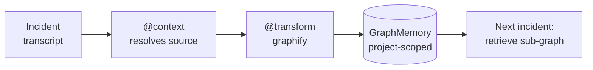

# Example 50 — Incident knowledge graph (the `@transform` directive)

> An on-call agent triages incident after incident, but each one is
> investigated from scratch — the connections it discovers stay buried in
> transcripts and are never reused. This example wires a single directive,
> `@transform(graphify, @context('incident transcript'))`, that distils each
> transcript into a relational graph the next incident can read.

This is the worked introduction to the **transform directive**. A transform
takes a body of text and applies a named operation to it; `graphify` is the
operation that extracts `subject → predicate → object` triples and writes them
into the project-scoped `GraphMemory`. The directive form runs the transform
**before** the LLM call — the directive engine executes it during prompt
resolution, so the work happens declaratively and on a small/cheap model.

## What this shows

1. **Incident 1 is triaged from scratch.** Its transcript is a wall of text:
   an alert, a deploy, an ownership note, a dependency, a root cause.
2. **`@transform(graphify, @context('incident transcript'))` distils it.** The
   `@context(...)` source is resolved to the transcript text first; the
   transform then graphifies that text into six triples —
   `PaymentsHighErrorRate → triggered-by → deploy-2026-05-10-payments`,
   `payments → depends-on → auth`, and so on — written to `GraphMemory`.
3. **Incident 2 starts from the graph, not a blank page.** When a related
   billing incident fires four days later, the agent retrieves the connected
   sub-graph straight from memory — the prior deploy, the shared dependency,
   the known root cause — instead of re-reading past transcripts.
4. **The knowledge graph accumulates.** Incident 2 is graphified too, and
   `billing → payments → auth` becomes one connected component.

## Flow



## How to run

### Offline (default, no API key)

```bash
python 50_incident_knowledge_graph.py
```

The example uses a deterministic stub relation-extractor, so it runs
end-to-end in under a second with no network and no API key.

### Live extraction

```bash
SAGEWAI_TRANSFORM_LIVE=1 OPENAI_API_KEY=sk-... python 50_incident_knowledge_graph.py
```

With `SAGEWAI_TRANSFORM_LIVE=1` set, `graphify` uses the real
`LLMRelationExtractor` to pull triples from the transcripts. Extraction is
`parse_json`-robust, so a fenced response from a small model still yields
clean triples.

## What's exercised

- `@transform(graphify, ...)` — the transform directive, resolved and executed
  pre-LLM, with a nested `@context(...)` source the engine resolves first
- `register_transform_directive` — the directive adapter that wires
  `@transform` onto a `DirectiveEngine`
- `TransformEngine` / `graphify` — the shared transform code path
- `GraphMemory` — the project-scoped relation store and its traversal
  (`add_relation`, `retrieve`)

## What you can change

- **Data source.** Replace the synthetic transcripts with a PagerDuty fetch
  or an export from your incident tool — `@context` can resolve from any
  configured context provider.
- **Operation.** Swap `graphify` for `summarize` to compress a transcript
  instead of structuring it, or register a custom operation.
- **Backend.** `GraphMemory` is in-memory here; the same `add_relation` /
  `retrieve` surface is implemented by `NebulaGraphMemory` for production.

## What to read next

- **Example 51** (`51_big_input_small_model.py`) — the other transform
  example: `@transform(summarize, ...)` to fit a document far larger than a
  small model's context window, plus a custom registered operation.
- **Example 41** (`41_graph_memory_incident_dependency.py`) — graph memory vs
  vector retrieval on incident dependencies; the retrieval-side companion to
  the graph this example *builds*.
- **Example 30** (`30_oncall_agent.py`) — the v1.0 on-call lighthouse that
  reacts to a single incident; pair it with this example for the
  "react + learn from structure" loop.
