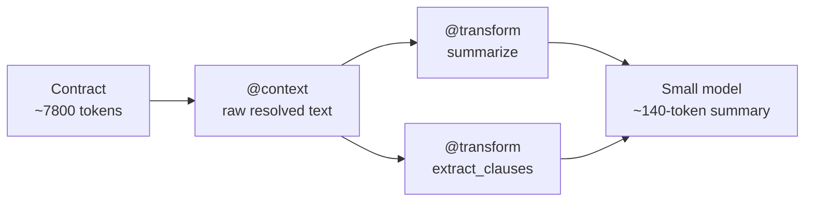

# Example 51 — A long document on a small local model (the `@transform` directive)

> You want cheap, private, local inference — an Ollama model on your own
> hardware. But your input is a 16-clause vendor contract several times larger
> than the model's context window. `@transform(summarize, @context('the
> contract'))` compresses the document inline, *before* the small model ever
> sees it, so a model with a small window can answer questions about a far
> larger input.

This is the second worked example of the **transform directive** (see
Example 50 for `graphify`). It shows two things: `summarize` as a way to fit
oversized input into a small window, and the **custom-operation registry** —
a transform operation is just an async function you register.

## What this shows

1. **The problem.** The synthetic contract is ~7,800 tokens — roughly 1.9× a
   4K-token window. A small local model cannot read it whole.
2. **`@transform(summarize, @context('the contract'))`.** The `@context(...)`
   source resolves to the raw contract text; `summarize` compresses it with a
   single LLM call. The ~7,800-token document becomes a ~140-token summary —
   comfortably inside the window. The compression happens during prompt
   resolution, so the small model only ever sees the short version.
3. **A custom operation.** `extract_clauses` is registered with
   `registry.register("extract_clauses", extract_clauses)` — a plain async
   function, no LLM. `@transform(extract_clauses, @context('the contract'))`
   returns the clause index; `@transform(extract_clauses, ..., keyword=data)`
   filters it. The op returns a bare string, which the engine wraps into a
   result.

## Flow



## How to run

### Offline (default, no API key)

```bash
python 51_big_input_small_model.py
```

`summarize` uses a stub LLM client that returns a canned summary, so the
example runs with no network and no API key. `extract_clauses` is pure Python
and runs identically offline and live.

### Live, on a local model

```bash
ollama pull llama3.2:3b
SAGEWAI_TRANSFORM_LIVE=1 python 51_big_input_small_model.py
```

With `SAGEWAI_TRANSFORM_LIVE=1`, `summarize` calls a real local model via
litellm. Override the model with `SAGEWAI_TRANSFORM_MODEL` (default
`ollama/llama3.2:3b`).

## What's exercised

- `@transform(summarize, ...)` — compress an input larger than the context
  window
- `@transform(extract_clauses, ...)` — a custom registered operation, invoked
  through the same directive surface, with a directive param
- `TransformRegistry.register` — the "run a function" registry; a custom op is
  any `async (content, *, project_id=None, **params) -> str | TransformResult`
- `register_transform_directive` — the directive adapter
- The transform runs on the *raw* resolved source text, not the per-model
  compressed prompt — so an operation that parses its input sees the real
  document

## What you can change

- **Operation.** Register your own op — a redactor, a translator, a
  table-extractor — with `registry.register(name, fn)` and call it as
  `@transform(name, ...)`.
- **Source.** `@context('the contract')` can resolve from any configured
  context provider — a file loader, a document store, a retrieval index.
- **Model.** Point `SAGEWAI_TRANSFORM_MODEL` at any litellm-supported model;
  the directive form means the engine does the compression regardless of how
  capable the model is.

## What to read next

- **Example 50** (`50_incident_knowledge_graph.py`) — the other transform
  example: `@transform(graphify, ...)` distilling incident transcripts into a
  knowledge graph.
- **Example 08** (`08_directives.py`) — the directive engine fundamentals:
  `@context`, `@memory`, `@agent`, `/tool`, and model profiles.
- **Example 18** (`18_local_llm_routing.py`) — running Sagewai against local
  models, the deployment context this example's "small model" assumes.
