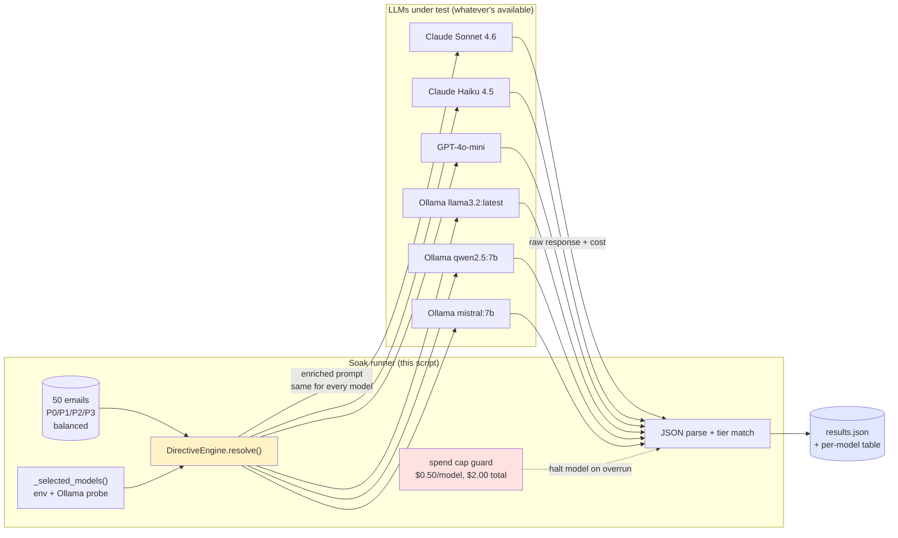
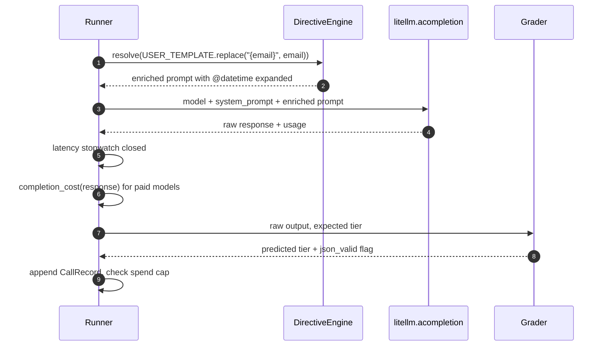

# Soak B — Directive library across LLMs

> One classification task, one prompt, several LLMs. The directive layer
> rewrites the prompt; LiteLLM swaps the model; the dataset stays
> fixed. Out the back come four numbers per model — accuracy,
> $/call, p50/p99 latency, JSON-output validity — that decide whether
> the *"harness any LLM"* claim survives a senior engineer's bullshit
> detector.

This is the publishable-numbers half of the directive pillar. It pairs
with Example 08 (`08_directives.py`), which shows the API; this script
shows the proof. It produces the data behind
`sagewai/atelier:docs/v1.0/directives-soak-report.md`.

## What this proves

Four invariants, end-to-end, against a single 50-sample held-out
classification dataset:

1. **The directive layer is LLM-agnostic.** The same
   `DirectiveEngine.resolve()` call feeds every model. No prompt is
   hand-tuned per provider. Any per-model gap is the model's, not the
   directive layer's.
2. **The cheapest LLM still passes the bar.** A 3.2B local model
   should land in the same accuracy ballpark as a paid frontier model
   on this task. If it doesn't, the directive layer's "harness any
   LLM" claim weakens and the launch copy must hedge.
3. **Output contract holds across models.** Every call is graded
   strict-JSON. A model that writes essays around the JSON instead of
   inside it fails — even if the right tier is hidden in the prose.
4. **Spend stays predictable.** Per-model cap is `$0.50`, total cap is
   `$2.00`. Either trips → run halts cleanly with a recorded
   `failure_reason`, never a silent overrun.

## Architecture



Time-ordered flow per sample, per model:



The two pieces touching are **Directives** (the engine that resolves
`@datetime`, future `@context`, `@memory` sigils into the prompt) and
**LiteLLM** (the swap point — same `acompletion()` call, different
`model` string). Everything else is bookkeeping.

## How to run

### On a clean machine (Ollama-only, no API key needed)

```bash
pip install sagewai
ollama pull llama3.2
python -m sagewai.examples._soaks.directives_soak
```

The script auto-detects what's available. With just one chat-tuned
Ollama model pulled it produces a single-row report; with three pulled
(`llama3.2`, `qwen2.5:7b`, `mistral:7b`) it covers the local family
the issue calls out. Runtime: roughly 1-2 minutes per Ollama model
(~50 calls × 1-2 s/call on a recent Mac).

### Full live path (paid + local)

```bash
export ANTHROPIC_API_KEY=sk-ant-...
export OPENAI_API_KEY=sk-...
ollama pull llama3.2 && ollama pull qwen2.5:7b && ollama pull mistral:7b
python -m sagewai.examples._soaks.directives_soak
```

This is the run that produces the publishable five-LLM table. Spend
caps are intentionally tight — `$0.50` per paid model, `$2.00`
overall — so a CI re-run cannot accidentally burn a real budget.
Estimated paid spend on the 50-sample dataset: under `$0.10` for
Sonnet 4.6 + Haiku 4.5 + GPT-4o-mini combined.

### Expected output (proof section)

```
─── The proof ─────────────────────────────────────────────────────────

  model                                   acc%   json%   p50ms   p99ms   $/call    total$
  ----------------------------------------  -----  ------  ------  ------  --------  --------
  ollama/llama3.2:latest                     XX.X   XXX.X    XXXX    XXXX  0.000000    0.0000
  ollama/qwen2.5:7b                          XX.X   XXX.X    XXXX    XXXX  0.000000    0.0000
  ollama/mistral:7b                          XX.X   XXX.X    XXXX    XXXX  0.000000    0.0000

  Total spend across 3 model(s): $0.0000 (cap was $2.00)
```

The script also writes the raw per-call records to
`~/.sagewai/directives-soak-results.json` (override with
`SAGEWAI_SOAK_RESULTS_PATH`). That JSON is what gets pasted into
`sagewai/atelier:docs/v1.0/directives-soak-report.md`.

## Real-world use cases

The pattern in this script — *one prompt template + directive
preprocessing + a model-swap loop* — is what a senior engineer at a
50-500-person SaaS will reach for once they decide to ship an
LLM-powered feature without locking in a single provider. Four
domains where they'll drop it in this quarter:

### 1. Customer-support ticket triage

Your support tooling reads incoming tickets from Zendesk / Intercom /
Front. You want an agent to assign an urgency tier and draft a
response.

| Concern | How this pattern solves it |
|---|---|
| Vendor lock-in — picking Anthropic today means a re-platforming bill if pricing shifts | Same prompt runs against any LiteLLM-supported provider; the soak's per-model rows tell you exactly what you'd lose by switching |
| The cheapest local model has to actually work for the boring tickets | The 50-sample held-out dataset is a regression suite — re-run it after any prompt or directive change to catch quality drift before a customer does |
| The CFO needs predictable spend before signing off on the rollout | Per-call cost in the table multiplies cleanly: 200 tickets/day × $/call × 30 days = a defensible monthly forecast |

### 2. Internal-tools agent at a mid-size SaaS

Your internal "ask the platform" bot calls Jira, GitHub, your CRM.
Some questions are easy ("what's the status of PROJ-1234?"); some
need a frontier model.

| Concern | How this pattern solves it |
|---|---|
| Sending every internal question to GPT-4o is wasteful but you don't want to gate behind manual model selection | Run this soak's pattern over a representative sample of past questions; promote the cheapest model that passes your accuracy bar to handle the easy class |
| Compliance asks "where does each prompt go?" before they sign off | The directive layer is one explicit preprocessing step; the LiteLLM call is one explicit egress; both are logged with model + token + cost |
| You want to add a local-only deployment tier for security-sensitive teams | The Ollama rows in the soak tell you which tier of local model is "good enough" for that team's workflows |

### 3. Multi-tenant LLM gateway

Your product is "LLM router as a service" — companies bring their
own keys. You need to sell them on cost-and-quality tradeoffs without
hand-waving.

| Concern | How this pattern solves it |
|---|---|
| Sales conversations stall on "which model should we pick?" | Re-run this soak with each prospect's representative dataset; hand them the table; the sale closes on data |
| Model providers ship new versions monthly | The soak is the regression suite — the diff between last quarter's table and this quarter's tells you what to update in your routing config |
| Customers want to see the prompt-engineering work without a vendor demo | The directive layer is the prompt-engineering surface, and it's open source. They run the same soak themselves |

### 4. Domain-specific classifier (urgency / sentiment / category)

You have a flow that needs a clean enum-valued label assigned by an
LLM — not a free-text response.

| Concern | How this pattern solves it |
|---|---|
| You can't ship a feature whose output is "usually" the right shape | The strict-JSON validity column in the table is a pre-merge gate — anything below 95% means the prompt or the model is wrong, not the downstream code |
| The team wants to swap to a cheaper / faster model and is afraid to | Re-run the soak with the candidate model added to the rotation; the side-by-side table is the migration plan |
| The dataset will grow and you need to detect quality drift | Pin the dataset to a versioned file; re-run the soak nightly; alert when accuracy on any model drops by more than 2 percentage points |

## What you can change

The soak is a thin substrate. Things to swap for your own dataset and
operational reality:

- **Dataset.** Replace the `SAMPLES` constant with your own
  `(label, text)` pairs. Keep balance across labels — an unbalanced
  dataset rewards always-predict-the-majority-class behaviour.
- **Tier labels.** The four `P0/P1/P2/P3` tiers in `SYSTEM_PROMPT` are
  one example. Sentiment (`pos/neg/neutral`), category, intent — any
  closed-set classification fits the same shape.
- **Models in the rotation.** `_selected_models()` reads env vars and
  the local Ollama; replace with an explicit list when you want
  exact reproducibility (e.g. for a regression suite that pins to
  specific model SHAs).
- **Spend caps.** `PER_MODEL_SPEND_CAP_USD` and
  `TOTAL_SPEND_CAP_USD` at the top of the file. Tighten for CI;
  raise for an exhaustive sweep.
- **Directive surface used.** Today the script uses `@datetime` to
  prove the engine round-trips — minimal but real. Add `@context` /
  `@memory` / `/tool.name` sigils when you want the soak to grade
  directive resolution itself, not just the LLM.
- **Grading.** `_parse_json_tier` accepts the strict shape plus a
  best-effort bracket extraction. For sentiment or intent
  classification with multi-word labels you'll want fuzzier matching.
- **Output destination.** The JSON results file path is overridable
  via `SAGEWAI_SOAK_RESULTS_PATH`. Point it at a CI artifact path and
  the soak's results survive past the run.

## What's exercised

- `sagewai.directives.DirectiveEngine` — prompt preprocessing entry
  point
- `DirectiveEngine.resolve(prompt)` returning a `DirectiveResult`
  with `.prompt` field
- `litellm.acompletion(model=..., messages=..., temperature=0.0)` for
  the model swap
- `litellm.completion_cost(completion_response=...)` for spend
  accounting on paid providers
- The Ollama tag-list endpoint at `127.0.0.1:11434/api/tags` for
  local model discovery (probed without `requests` to keep the
  dependency footprint at zero beyond the SDK)

## What to read next

- **`packages/sdk/sagewai/examples/08_directives.py`** — the public
  API tour for `DirectiveEngine`. Read it first if you have not seen
  the directive surface before.
- **`packages/sdk/sagewai/examples/18_local_llm_routing.py`** — the
  lighthouse-tour example for the same model-swap claim, but framed
  as a tier-routing demo rather than a soak.
- **`sagewai/atelier:docs/v1.0/memory-soak-report.md`** — sister soak
  for the memory + RAG pillar; same shape, same publishable-numbers
  bar, different pillar.
- **`sagewai/atelier:docs/v1.0/lighthouse-tour.md`** — Gap #6 is the
  parent issue (atelier #9). Once Soaks A, B, and C all land, the
  three reports together close that gap.
