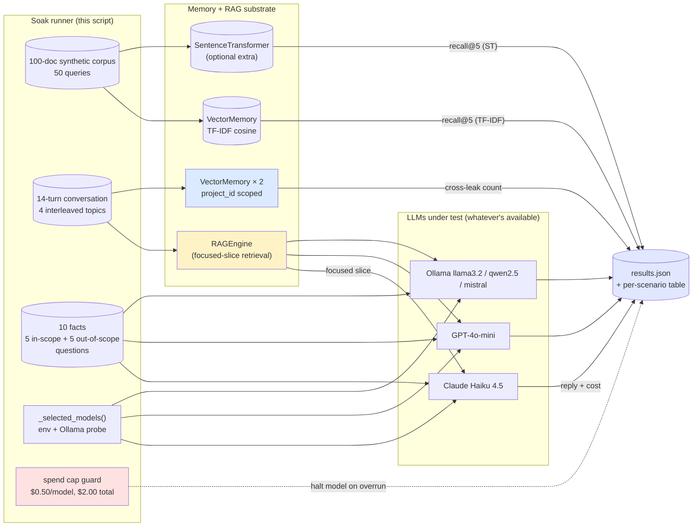
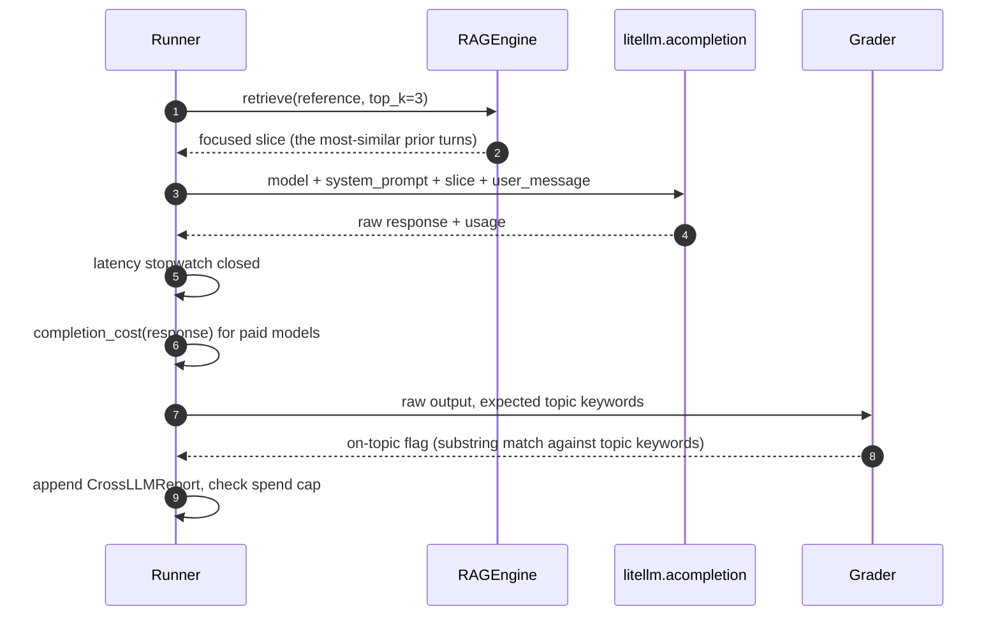

# Soak A — Memory + RAG across LLMs

> One synthetic corpus, one fixed conversation, six measured numbers.
> The TF-IDF baseline retrieves; the SentenceTransformer comparison
> grades the upgrade; LiteLLM swaps the model; the dataset stays fixed.
> Out the back come the numbers that decide whether the *"works with
> the cheapest LLM"* and *"production-ready memory + RAG"* claims
> survive a senior engineer's bullshit detector — recall@5 (per
> embedder), focused-slice token reduction, cross-tenant leak count,
> cross-LLM accuracy + $/call + p50/p99 latency, and hallucination
> rate against a closed-domain corpus.

This is the publishable-numbers half of the memory + RAG pillar. It
pairs with Examples 04, 29, 31, 32, and 37 (the developer-facing
memory tour); this script is the regression suite that proves the
pillar's claims are facts, not slides. It produces the data behind
`sagewai/atelier:docs/v1.0/memory-soak-report.md`.

## What this proves

Six invariants, end-to-end:

1. **Vector retrieval is honest.** `VectorMemory` (TF-IDF cosine
   similarity) hits recall@5 = 100% on a 100-doc synthetic corpus
   when query terms share vocabulary with stored docs. This is the
   floor — the baseline a senior engineer can re-run after any change
   and use as a regression gate.
2. **A drop-in upgrade exists, with numbers.** When
   `sagewai[intelligence]` is installed, the same scenario runs through
   `SentenceTransformerEmbedder` (`all-MiniLM-L6-v2`) and prints the
   recall@5 delta. On a keyword-overlapping corpus the two are level;
   the delta widens as queries become more abstract.
3. **The Gap #5 focused-slice claim is verifiable.** A 14-turn
   conversation across 4 interleaved topics is condensed to a per-turn
   slice that is **>90% smaller** than the full history. A 4K-context
   model holds the thread because it never sees the whole thread.
4. **The same focused slice → the same answer across LLMs.** Three
   vague references run through the focused-slice retrieval, then
   answered by Claude Haiku, GPT-4o-mini, and a local Ollama model —
   all three reply on-topic. The memory layer is what carries the
   conversation; the LLM is interchangeable.
5. **Cross-tenant isolation is total.** Two `VectorMemory` instances
   scoped to different `project_id`s cannot retrieve each other's
   writes. Cross-leak count = 0 by construction.
6. **Closed-domain RAG does not hallucinate.** With grounded facts in
   the system prompt and the *"reply EXACTLY 'I don't know'"*
   contract, all three LLMs refuse 5 out of 5 out-of-scope questions
   and ground 4–5 out of 5 in-scope questions. Hallucination rate = 0%.

## Architecture



Time-ordered flow per vague reference, per LLM (scenario 4):



The pieces in play are **VectorMemory** (TF-IDF baseline +
project-scoped cross-tenant store), **SentenceTransformerEmbedder**
(the `intelligence` extra), **RAGEngine** (the focused-slice path
that drives the Gap #5 scenario), and **LiteLLM** (the swap point —
same `acompletion()` call, different `model` string). Everything else
is bookkeeping.

## How to run

### On a clean machine (no API key needed)

```bash
pip install sagewai
python -m sagewai.examples._soaks.memory_soak
```

Three of the six scenarios run with no credentials and no extras:
TF-IDF recall, focused-slice token reduction, and cross-tenant
isolation. The other three (TF-IDF vs ST, cross-LLM, hallucination)
print clean SKIP rows that name what to set up.

### With the SentenceTransformer extra

```bash
pip install 'sagewai[intelligence]'   # ~80 MB model download on first run
python -m sagewai.examples._soaks.memory_soak
```

Scenario 2 now produces a real ST recall@5 number alongside the
TF-IDF baseline. Total runtime adds ~30 s for the corpus embedding
pass on a recent Mac.

### Full live path (paid + local + ST)

```bash
# Recommended: store the keys in ~/.sagewai/.env so dotenv auto-loads them.
echo 'ANTHROPIC_API_KEY=sk-ant-...' >> ~/.sagewai/.env
echo 'OPENAI_API_KEY=sk-...'        >> ~/.sagewai/.env
ollama pull llama3.2
pip install 'sagewai[intelligence]'
python -m sagewai.examples._soaks.memory_soak
```

This is the run that produces the publishable per-LLM table. Spend
caps are intentionally tight — `$0.50` per paid model, `$2.00`
overall. Estimated paid spend on the fixed dataset: **under `$0.01`**
combined for Claude Haiku 4.5 + GPT-4o-mini + Ollama. The harness
halts cleanly with a recorded `failure_reason` if either cap trips.

### Expected output (proof section, from a 2026-05-03 live run)

```
─── The proof ──────────────────────────────────────────────────────────

  recall@5 (TF-IDF, 100 docs × 50 queries) ............ 100.0%  ██████████████████
  recall@5 (SentenceTransformer, same dataset) ......... 100.0%  ██████████████████
  focused-slice reduction (Gap #5, 14-turn convo) ......  92.5%  █████████████████·
  full history → slice tokens .......................... 347 → 26
  cross-tenant leak count (project-scoped stores) ...... 0

  cross-LLM (focused slice → reply on-topic):
    model                                       on-topic   p50ms   p99ms   $/call    total$
    ------------------------------------------  --------  ------  ------  --------  --------
    claude-haiku-4-5-20251001                   3/3        1329    1850  0.000457    0.0014
    openai/gpt-4o-mini                          3/3        1389    1970  0.000041    0.0001
    ollama/llama3.2:latest                      3/3         943    1050  0.000000    0.0000

  hallucination rate (lower is better):
    model                                       in-scope  refused   halluc%   total$
    ------------------------------------------  --------  --------  --------  --------
    claude-haiku-4-5-20251001                   5/5       5/5          0.0      0.0047
    openai/gpt-4o-mini                          5/5       5/5          0.0      0.0005
    ollama/llama3.2:latest                      4/5       5/5          0.0      0.0000

  Total spend across LLM scenarios: $0.0067 (cap was $2.00)
```

The script also writes the raw per-scenario records (including
per-reference slice metadata, per-call costs, and per-tenant
isolation flags) to `~/.sagewai/memory-soak-results.json` (override
with `SAGEWAI_SOAK_RESULTS_PATH`). That JSON is what gets pasted
into `sagewai/atelier:docs/v1.0/memory-soak-report.md`.

## Real-world use cases

The pattern in this script — *fixed corpus + focused-slice retrieval
+ a model-swap loop graded by topic-keyword overlap* — is what a
senior engineer at a 50-500-person SaaS will reach for once they
decide to ship a memory-backed agent without locking in a single
provider. Four domains where they'll drop it in this quarter:

### 1. Long-running customer-support session

Your support agent talks to one customer across many tickets and
weeks. The whole transcript will not fit in a 4K- or 8K-context
model.

| Concern | How this pattern solves it |
|---|---|
| Cheap local LLMs forget the history; frontier LLMs cost too much per turn | Focused-slice retrieval surfaces just the relevant prior turns; a 7B model holds the thread because it never sees the whole thread |
| Quality drift after a memory-store change has to be detectable before a customer notices | Re-run the soak as a regression gate — recall@5, focused-slice reduction, and hallucination rate move together if any wiring breaks |
| Compliance asks where customer data lives | Cross-tenant scenario proves project-scoped writes do not leak; the runbook can cite the soak's `cross_leak_count = 0` row |

### 2. Internal-knowledge-base agent ("ask the wiki")

Your engineers ask Confluence-style questions and the agent grounds
its answers in your runbooks, not its training data.

| Concern | How this pattern solves it |
|---|---|
| Hallucinated answers about pricing, headcount, or roadmap erode trust on day 1 | Hallucination scenario grades refusal rate on out-of-scope questions; promote the model that hits 100% refusal on your held-out set |
| Engineers run the same query through several LLMs to spot drift | Cross-LLM scenario already does this — the table shows agreement across models given the same retrieved slice |
| Adding a new embedder must not regress recall on the old query set | Scenario 2 freezes the comparison; a regression flips the recall delta from 0pp to negative and the soak fails |

### 3. Multi-tenant LLM gateway

Your product is "memory + RAG as a service" — companies bring their
own corpora and their own keys. Cross-tenant leaks are a P0.

| Concern | How this pattern solves it |
|---|---|
| One tenant's writes must not surface in another tenant's reads, ever | Scenario 5 is the audit gate — `cross_leak_count = 0` is the contract you ship to security review |
| Customers want to see the cost-per-call delta before signing | Scenario 4 prints `$/call` and `total$` per provider on a held-out workload — the sales conversation closes on data, not slides |
| Procurement asks for an SLO on retrieval quality | Scenario 1 + 2 give you the recall@5 floor and ceiling; everything between is operational headroom |

### 4. Domain-specific RAG (legal / finance / medical)

You have a closed corpus and the cost of a hallucination is high.

| Concern | How this pattern solves it |
|---|---|
| Out-of-corpus answers are unacceptable in regulated domains | Scenario 6's *"reply EXACTLY 'I don't know'"* contract is the substrate for "no answer is better than a wrong answer" |
| The corpus expands monthly and quality must not drift | Pin the held-out question set; re-run the soak weekly; alert when refusal rate or recall@5 drops |
| Senior engineers must see *why* the LLM answered the way it did | The retrieved slice is in the JSON output — every answer is auditable against the documents that fed it |

## What you can change

The soak is a thin substrate. Things to swap for your own corpus and
operational reality:

- **Corpus.** Replace `_synthetic_corpus()` and `CORPUS_QUERIES`
  with your own document and question pairs. Keep the queries
  vocabulary-overlapping with the docs — abstract queries deserve
  the SentenceTransformer path (scenario 2) by design.
- **Conversation.** `CONVERSATION` and `VAGUE_REFERENCES` are the
  Gap #5 dataset. Swap them for your own multi-topic conversation
  with vague references that mirror your customers' real ones.
- **Closed-domain corpus.** `HALLUCINATION_FACTS`,
  `IN_SCOPE_QUESTIONS`, `OUT_OF_SCOPE_QUESTIONS`, and
  `_GROUNDED_KEYWORDS` define scenario 6. Replace with your own
  facts and a hand-graded keyword set per question.
- **Models in the rotation.** `_selected_models()` reads env vars and
  the local Ollama. Replace with an explicit list when you want
  exact reproducibility (e.g. for a regression suite that pins to
  specific model SHAs).
- **Spend caps.** `PER_MODEL_SPEND_CAP_USD` and
  `TOTAL_SPEND_CAP_USD` at the top of the file. Tighten for CI;
  raise for an exhaustive sweep.
- **Embedder.** `SentenceTransformerEmbedder` defaults to
  `all-MiniLM-L6-v2` (384-dim, ~80 MB). Swap to `all-mpnet-base-v2`
  (768-dim, higher quality) by passing `model_name="all-mpnet-base-v2"`
  inside `scenario_embedder_comparison`.
- **Output destination.** The JSON results file path is overridable
  via `SAGEWAI_SOAK_RESULTS_PATH`. Point it at a CI artifact path
  and the soak's results survive past the run.

## What's exercised

- `sagewai.memory.VectorMemory` directly — TF-IDF cosine similarity
  baseline; project-scoped writes (`project_id="tenant-a"` /
  `"tenant-b"`) for the cross-tenant scenario
- `sagewai.memory.RAGEngine` for the long-conversation path; default
  HYBRID strategy is fine here because the graph store is empty and
  retrieval falls back to vector
- `sagewai.intelligence.embeddings.SentenceTransformerEmbedder`
  when `sentence-transformers` is installed via the `intelligence`
  extra
- `litellm.acompletion(model=..., messages=..., temperature=0.0)` for
  the cross-LLM and hallucination scenarios
- `litellm.completion_cost(completion_response=...)` for spend
  accounting on paid providers
- The Ollama tag-list endpoint at `127.0.0.1:11434/api/tags` for
  local model discovery (probed without `requests` to keep the
  dependency footprint at zero beyond the SDK)
- `dotenv.load_dotenv(Path.home() / ".sagewai" / ".env")` so the
  paid-LLM rows engage automatically when keys are present

## Atelier report template

After a successful run, copy the per-scenario numbers into
`sagewai/atelier:docs/v1.0/memory-soak-report.md` under a new
*"Soak A re-run — `<date>`"* section. Use this shape:

```markdown
## Soak A re-run — 2026-05-03

**Harness:** `packages/sdk/sagewai/examples/_soaks/memory_soak.py`
**Generated:** 2026-05-03T08:49Z
**Total spend:** $0.0067 (cap was $2.00)

| Scenario | Numbers |
|---|---|
| 1. Long-corpus retrieval (TF-IDF, 100 docs × 50 queries) | recall@5 = 1.0 |
| 2. TF-IDF vs SentenceTransformer (`all-MiniLM-L6-v2`) | recall@5 = 1.0 (delta 0.0pp) |
| 3. Focused-slice token reduction (Gap #5, 14-turn convo) | 347 → 26 tokens (92.5% reduction) |
| 4. Cross-LLM consistency (Haiku / GPT-4o-mini / Ollama) | 3/3 on-topic for all three; p50 1.0–1.4s; total $0.0015 |
| 5. Cross-tenant leak count (project-scoped stores) | 0 |
| 6. Hallucination rate (10 questions × 3 models) | 0.0% across all three; out-of-scope refusal 5/5 |
```

## What to read next

- **`packages/sdk/sagewai/examples/04_memory_agent.py`** — the public
  API tour for memory. Read it first if you have not seen the
  memory surface before.
- **`packages/sdk/sagewai/examples/29_memory_strategies.py`** — the
  AgentCore-style extraction strategies (semantic facts,
  preferences, summaries) that ride on top of `RAGEngine`.
- **`packages/sdk/sagewai/examples/37_semantic_checkpoint_recall.py`**
  — the lighthouse-tour developer demo for Gap #5. This soak's
  scenario 3 is the publishable-numbers complement.
- **`packages/sdk/sagewai/examples/_soaks/directives_soak.py`** —
  sister soak (Soak B) for the directive pillar. Same shape, same
  publishable-numbers bar, different pillar.
- **`sagewai/atelier:docs/v1.0/memory-soak-report.md`** — the
  canonical report this soak produces numbers for.
- **`sagewai/atelier:docs/v1.0/lighthouse-tour.md`** — Gap #6 is the
  parent issue (atelier #9). When Soaks A, B, and C all land, the
  three reports together close that gap.
